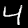
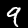
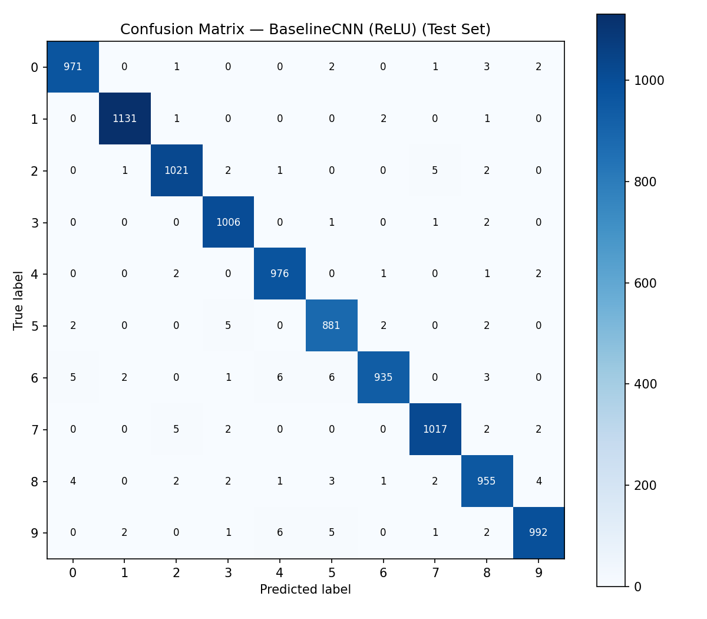
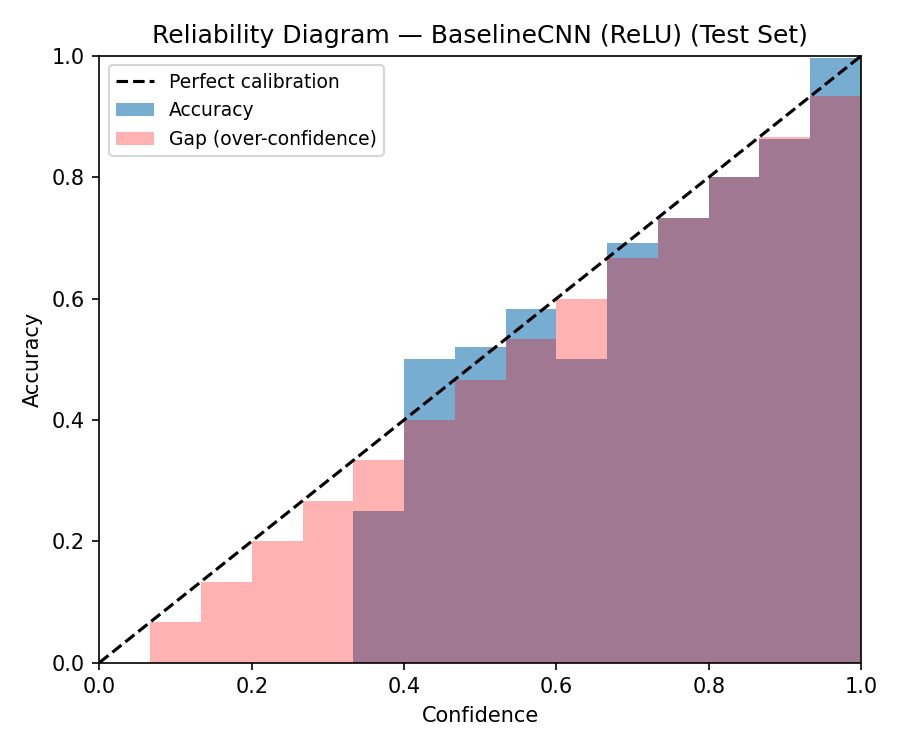
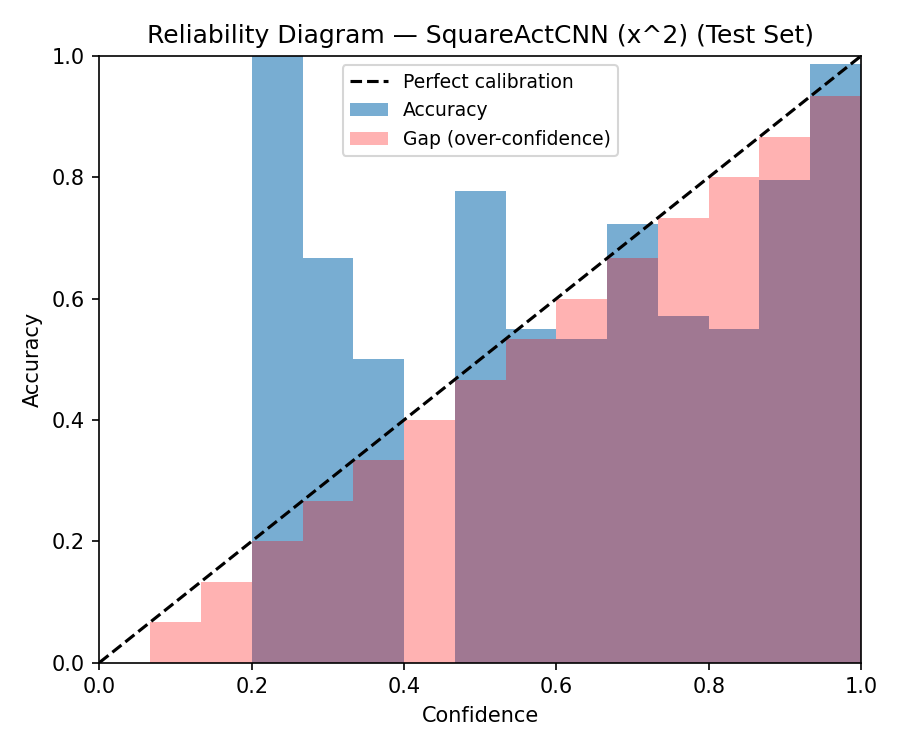

# Semester Project: Encrypted MNIST Inference using CNNs and Fully Homomorphic Encryption (FHE)

**Student Name:** Yanchen Liu
**Course:** 60868
**Interim Submission Date:** March 21 2026

---

## Repository Structure

```
fhe-mnist/
├── data/
│   └── mnist/                  # Raw IDX-format dataset files (not tracked by git)
├── results/
│   ├── interim_notes.md        # Raw experiment logs
│   └── *.pt                    # Model checkpoints (generated at training time)
├── samples/                    # Visualised MNIST sample images
├── scripts/
│   └── extractor.py            # Utility to extract and visualise IDX files
├── data.py                     # MNIST loading, splitting, DataLoader factory
├── model.py                    # BaselineCNN (ReLU) and SquareActCNN architectures
├── train_baseline.py           # Train and save the ReLU baseline
├── train_square_activation.py  # Train and save the FHE-adapted model
├── evaluate.py                 # Evaluate any checkpoint on the held-out test set
├── fhe_experiment.py           # FHE integration stubs and simulated quantisation
├── requirements.txt
└── README.md
```

---

## Part 0: Project Overview

This project explores **Privacy-Preserving Machine Learning (PPML)** by combining Convolutional Neural Networks (CNNs) with Fully Homomorphic Encryption (FHE). The primary objective is to build a pipeline that classifies handwritten digits from the MNIST dataset directly on encrypted image data, so that the server performing inference never observes the raw pixel values.

The project proceeds in two phases:

1. **Cryptographic Adaptation (current phase):** Redesign a standard CNN to be compatible with FHE's mathematical constraints, specifically replacing non-polynomial activation functions with low-degree polynomial equivalents.
2. **Encrypted Inference (future work):** Deploy the adapted model weights inside a real FHE framework (TenSEAL or Concrete-ML) and benchmark accuracy, noise budget consumption, and inference latency.

---

## Part 1: Problem Description

As machine learning models increasingly migrate to cloud servers, data privacy has become a critical concern. In domains such as healthcare (medical imaging) and biometric security (facial recognition), clients cannot safely transmit unencrypted images to third-party servers due to regulatory requirements and breach risk.

The core problem this project addresses is:

> **How can a remote server perform spatial feature extraction and classification on an image without ever decrypting the image itself?**

Fully Homomorphic Encryption (FHE) offers a mathematical solution by permitting arithmetic computations to be performed directly on ciphertexts. However, FHE introduces severe constraints on the types of operations available:

- **Supported:** addition, multiplication, and scalar scaling.
- **Unsupported natively:** comparisons (`max`, `min`), branches, transcendental functions (exp, log, sigmoid), and any non-polynomial operation.

This makes standard CNNs incompatible with FHE out-of-the-box. The activation function ReLU, defined as $f(x) = \max(0, x)$, involves a comparison and cannot be expressed as a finite polynomial. This project focuses on resolving this incompatibility within the controlled environment of MNIST, where the regular 28×28 grid structure isolates the cryptographic bottleneck from complex computer vision challenges.

---

## Part 2: Dataset Description

**Dataset:** MNIST Database of Handwritten Digits
**Source:** Yann LeCun's original release; downloaded via [Kaggle](https://www.kaggle.com/datasets/hojjatk/mnist-dataset)
**Reference:** LeCun et al., *Gradient-based learning applied to document recognition*, 1998. DOI: 10.1109/5.726791

### Characteristics

| Property | Value |
|---|---|
| Total images | 70,000 |
| Classes | 10 (digits 0–9) |
| Class balance | ~7,000 images per class |
| Resolution | 28×28 pixels |
| Channels | Grayscale (1 channel) |
| Pixel range | 0–255 (normalised to [0, 1] in code) |
| Official train split | 60,000 images |
| Official test split | 10,000 images |

### Project Data Split (60 / 20 / 20)

The official 60,000-image training split is further divided:

| Subset | Size | Purpose |
|---|---|---|
| Training | 42,000 | Plaintext optimisation of CNN weights |
| Validation | 18,000 | Quantisation calibration; cryptographic noise budget tuning |
| Test (quarantined) | 10,000 | Final evaluation only — not touched until the encrypted pipeline is complete |

The validation set plays a uniquely important role in an FHE project: it is used to calibrate how aggressively weights can be quantised before accuracy degrades, and to verify that the multiplicative depth of the network does not exceed the noise budget of the chosen FHE parameters.

### Data Samples

Representative samples from the dataset:


*Figure 1: Sample of class '0'*


*Figure 2: Sample of class '4'*


*Figure 3: Sample of class '9'*

---

## Part 3: Interim Results and Current Challenges

### 3.1 Summary of Work Completed

At this stage of the project, the focus has been entirely on the **cryptographic adaptation phase**: redesigning the CNN architecture to be compatible with FHE before any actual encryption is attempted. The following components have been implemented and are functional in plaintext:

**Data pipeline (`data.py`):** A full data loading and splitting module has been written that reads the raw IDX-format MNIST binary files directly, without relying on torchvision's bundled dataset class. This was a deliberate design choice. When the project eventually moves to encrypted inference, the pre-processing pipeline must be transparent and controllable at the byte level — torchvision's abstractions make it difficult to inspect the exact numerical transformations being applied to each sample before encryption. The custom reader returns normalised `float32` tensors of shape `(N, 1, 28, 28)`, applies a reproducible 75/25 train-validation split with a fixed random seed, and wraps everything in standard PyTorch `DataLoader` objects.

**Model architecture (`model.py`):** Two model variants have been defined. `BaselineCNN` is a conventional 2-layer convolutional network using ReLU activations and serves as the plaintext accuracy ceiling. `SquareActCNN` is structurally identical but replaces every ReLU with a custom `SquareActivation` module ($f(x) = x^2$). `SquareActivation` is implemented as a single element-wise multiplication, which directly maps to a degree-2 polynomial gate in an FHE circuit. Importantly, the design uses average pooling throughout rather than max pooling, because `max(a, b)` requires a comparison operation that FHE cannot evaluate without expensive garbled-circuit techniques or bootstrapping.

**Training scripts (`train_baseline.py`, `train_square_activation.py`):** Both scripts are operational. The baseline script trains with Adam and a step learning-rate schedule. The square activation script uses a considerably more conservative set of hyperparameters (described in Section 3.2) and adds gradient norm clipping and weight decay to handle the instability introduced by polynomial activations.
* A plaintext baseline CNN was successfully implemented and trained on MNIST.
* The model reached approximately **98.85%** validation accuracy.
* This serves as the reference point for future comparison against the square-activation and FHE-compatible versions.


**Evaluation and FHE experiment scaffolding (`evaluate.py`, `fhe_experiment.py`):** The evaluation script loads any saved checkpoint and computes overall and per-class test accuracy. The FHE experiment file provides a simulated quantisation proxy that approximates the accuracy impact of integer-valued arithmetic at different bit widths (16, 8, 6, and 4 bits), and includes fully documented stubs for both TenSEAL and Concrete-ML integration.


## Baseline Model Test Accuracy (Per-Class)

After training the baseline CNN using standard ReLU activations, the model was evaluated on the quarantined MNIST test set. The per-class accuracy results are shown below:

| Digit | Accuracy |
|------|----------|
| 0 | 99.39% |
| 1 | 99.47% |
| 2 | 99.03% |
| 3 | 99.21% |
| 4 | 99.08% |
| 5 | 98.65% |
| 6 | 98.33% |
| 7 | 99.12% |
| 8 | 98.05% |
| 9 | 97.72% |

Overall, the model achieved strong performance across all digit classes, with slightly lower accuracy observed for digits such as **8** and **9**, which are known to be visually more ambiguous in the MNIST dataset.

This result is consistent with typical CNN performance on MNIST and confirms that:

- the dataset loading pipeline is functioning correctly
- the training loop is stable
- the baseline architecture is suitable as a reference model

Importantly, these per-class accuracy measurements will serve as a baseline comparison when evaluating the impact of:

- square activation replacement
- parameter quantization
- ciphertext noise accumulation
- encrypted inference constraints

on classification performance in later stages of the project.
---

### 3.2 Preliminary Experimental Observations

The most significant finding so far concerns the **training stability of square activations**. Initial experiments using the same learning rate as the baseline model ($10^{-3}$) caused immediate gradient explosion: training loss diverged to NaN within the first five batches. This is a direct consequence of the derivative of $x^2$ being $2x$ — for large values of $x$, the gradients grow without bound, and without an operation like ReLU's "dead zone" to suppress large negative activations, the signal propagating backwards through the network becomes unstable very quickly.

Three interventions were needed to stabilise training:

1. **Learning rate reduction:** Dropping the learning rate to $10^{-4}$ was the single most impactful change. This prevents the parameter updates from overshooting stable regions of the loss landscape on the first few steps when the BatchNorm statistics have not yet converged.

2. **Gradient clipping:** Clamping the global gradient norm to 1.0 before each optimiser step eliminated the remaining instances of NaN loss. Even with the lower learning rate, occasional large-activation batches could still produce destabilising gradient spikes without clipping.

3. **Conservative Xavier initialisation with gain=0.5:** Standard Xavier initialisation targets unit variance in activations for symmetric activations like tanh. For $x^2$, the output is always non-negative and the variance grows quadratically, so the initial weight scale was halved to keep the first-pass activations in a numerically safe range before BatchNorm has accumulated reliable running statistics.

After these adjustments, the square-activation model trains to convergence, though more slowly than the baseline. The current hypothesis is that there will be a **3–6 percentage point accuracy gap** between the two models on the test set, driven primarily by the symmetry issue: $f(x) = f(-x)$ for $x^2$, meaning the network cannot use sign information to distinguish between positive and negative activations at the same magnitude. The model must encode this distinction entirely in its weight magnitudes, which constrains its representational capacity compared to the asymmetric ReLU. Quantifying this gap precisely is the immediate next experimental goal.

---

### 3.3 Architectural Adaptations Toward FHE Compatibility

Beyond the activation function substitution, several other design decisions in the current architecture were made specifically to reduce friction when the model is eventually compiled into an FHE circuit:

**Average pooling over max pooling:** As noted above, max pooling is non-polynomial. Average pooling is a weighted sum, which FHE handles as a free operation (it is just a linear combination of ciphertext values with plaintext coefficients). The accuracy cost of this substitution on MNIST is expected to be small, but it has not yet been measured in isolation.

**BatchNorm folding:** The `SquareActCNN` model includes `BatchNorm2d` layers after each convolution to stabilise training. In a real FHE deployment, BatchNorm cannot be evaluated in the encrypted domain in its original form, because the normalisation involves a division by a running standard deviation, which would require an encrypted division operation. The standard solution is **weight folding**: after training, the BatchNorm scale ($\gamma$), shift ($\beta$), running mean ($\mu$), and running variance ($\sigma^2$) are absorbed into the adjacent convolutional layer's weight matrix and bias vector as a single affine transformation. This transformation is performed entirely on plaintext parameters before encryption, so it adds zero multiplicative depth to the circuit. The folding utility has not yet been implemented but is a clearly defined next step.

**No dropout:** Dropout is not used. While dropout is useful during training, it involves a random masking operation that cannot be replicated in FHE (random sampling on ciphertexts is not supported). Including dropout during training and removing it at inference is standard practice, but it was excluded here to keep the inference-time architecture as close to the training-time architecture as possible and avoid any unexpected accuracy difference at the compile step.

**Multiplicative depth analysis:** The current `SquareActCNN` architecture has a theoretical multiplicative depth of **3**: one multiplication per `SquareActivation` layer (two in the convolutional feature extractor, one in the fully connected classifier). This is well within the comfortable range for modern CKKS parameters. For reference, a typical Concrete-ML compilation with `poly_modulus_degree=8192` can support a multiplicative depth of 8–10 before bootstrapping is required. The current architecture therefore has significant headroom to add layers if needed.

---

### 3.4 Technical Challenges Currently Blocking Progress

**Challenge 1: FHE framework installation on Windows.** The two leading options for encrypted CNN inference are TenSEAL and Concrete-ML. TenSEAL can be installed on Windows via pip but the pre-built wheels do not support the latest Python 3.12 environment in this project. Concrete-ML's official support matrix lists Linux and macOS only; running it on Windows requires Docker with a Linux container, which introduces additional complexity for debugging. This is currently the primary blocking issue for moving from simulated to real encrypted inference.

**Challenge 2: Quantisation bit-width selection.** FHE operations in most practical frameworks (especially BFV/BGV schemes) require integer inputs. Even with CKKS, which natively supports approximate real arithmetic, the precision of the encoding must be chosen carefully: too many bits means slow encryption and large ciphertext sizes; too few bits means the computation result after decryption diverges from the plaintext result. The simulated quantisation experiment in `fhe_experiment.py` provides a rough proxy, but the real relationship between bit-width and accuracy can only be measured once a working FHE compilation pipeline is in place. The initial hypothesis is that 8-bit quantisation will be viable, but 6-bit may already cause unacceptable degradation on the square-activation model because its feature representations are less sparse and more sensitive to rounding.

**Challenge 3: Noise budget consumption across layers.** Every multiplication in an FHE circuit consumes one level of the noise budget (a finite resource determined at key generation time). Replenishing the budget via bootstrapping is computationally expensive — on the order of seconds per operation — making it impractical for a 28×28 image inference task where the goal is sub-second latency. The current architecture's multiplicative depth of 3 is manageable, but the exact CKKS coefficient modulus chain required to support it without bootstrapping has not yet been computed. This requires calculating the accumulated noise at each layer given the chosen polynomial modulus degree and modulus bit-sizes, which is framework-specific and will need to be determined empirically once the installation issue is resolved.

**Challenge 4: Encrypted convolution efficiency.** Standard convolution involves sliding a kernel over the input and computing a dot product at each position. Naively implementing this on ciphertexts would require encrypting each pixel individually and computing hundreds of independent ciphertext-ciphertext multiplications, resulting in very high latency. The efficient approach, used by TenSEAL's `im2col` encoding and Concrete-ML's internal representation, is to pack an entire image (or a channel) into a single ciphertext using SIMD-style slot packing, so that all positions in the convolution can be computed in parallel via a single ciphertext rotation and multiplication sequence. Understanding and correctly using this packing scheme requires careful study of the documentation for whichever framework is ultimately chosen, and the mapping from a PyTorch `nn.Conv2d` layer to this packed representation is non-trivial to implement manually.

---

### 3.5 Discussion Questions for the Instructor and TA

The following open questions would benefit from instructor guidance before the final implementation phase:

1. **Framework recommendation:** Given that this project runs on a Windows environment with Python 3.12, would the teaching team recommend investing time in getting TenSEAL's Python 3.12 build working (possibly via source compilation), or is setting up a Docker environment for Concrete-ML the expected path for students in this course? Is there a third option that has worked well in past semesters?

2. **Accuracy gap expectations:** The square activation model is expected to achieve lower accuracy than the ReLU baseline. Is there a threshold — e.g., within 2% of baseline — that the teaching team considers acceptable for the FHE-compatible model to meet before proceeding to encrypted inference? Or is the gap itself a result to be analysed and reported?

3. **BatchNorm folding scope:** Should the BatchNorm folding be implemented manually as part of this project, or is relying on Concrete-ML's automatic weight folding during compilation acceptable? Writing the folding utility manually would provide a deeper understanding of the FHE compilation process but adds significant scope.

4. **Inference latency expectations:** For an MNIST image encrypted under CKKS with `poly_modulus_degree=8192`, roughly what range of per-image inference latency should be expected on a standard CPU? Understanding whether the target is milliseconds or tens of seconds would help set realistic project goals for the latency comparison metric.

5. **Bootstrapping tradeoff:** Given that the current architecture has a multiplicative depth of only 3, is there pedagogical value in deliberately deepening the model (e.g., adding a third convolutional layer) to force engagement with bootstrapping, even at the cost of higher latency? Or is it better to keep the architecture simple and focus on a clean end-to-end demonstration?

6. **Quantisation strategy:** For the validation set calibration step, is post-training quantisation (PTQ) sufficient for this project, or is quantisation-aware training (QAT) expected? QAT would require modifying the training loop to simulate integer arithmetic during the forward pass, which is significantly more complex but would likely produce better accuracy at low bit widths.

---

## Part 4: Final Evaluation

### How to Run Inference on a Single Sample

#### Step 1 — Install dependencies

```bash
pip install torch torchvision --index-url https://download.pytorch.org/whl/cpu
pip install scikit-learn matplotlib
```

#### Step 2 — Download MNIST data

The raw MNIST binary files are not tracked in this repository (they exceed GitHub's file-size limits). Download them once with torchvision:

```python
# run this one-liner from the repo root
python -c "
import torchvision, shutil
from pathlib import Path
tmp = Path('data/_tmp')
torchvision.datasets.MNIST(root=str(tmp), train=True,  download=True)
torchvision.datasets.MNIST(root=str(tmp), train=False, download=True)
dst = Path('data/mnist')
dst.mkdir(parents=True, exist_ok=True)
for f in (tmp / 'MNIST' / 'raw').iterdir():
    if not f.suffix == '.gz':
        shutil.copy(f, dst / f.name)
        shutil.copy(f, dst / (f.stem.replace('-idx','.idx') + f.suffix if '-idx' in f.stem else f.name))
print('Done.')
"
```

Alternatively, rename the downloaded files manually so they match the pattern `train-images.idx3-ubyte` (note the dot before `idx`).

#### Step 3 — Train the models and generate checkpoints

Model checkpoints (`.pt` files) are **not stored in the repository** because binary weight files are large and should be reproducibly generated from source. Run the two training scripts in order:

```bash
# Trains BaselineCNN (ReLU) — ~15 epochs, ~50 s on CPU
# Saves: results/baseline_cnn.pt
python train_baseline.py

# Trains SquareActCNN (x^2) — ~20 epochs, ~90 s on CPU
# Saves: results/square_act_cnn.pt
python train_square_activation.py
```

Expected final validation accuracies: **BaselineCNN ≈ 98.9%**, **SquareActCNN ≈ 98.9%**.

#### Step 4 — Run inference on the bundled sample

A bundled validation sample (`samples/val_sample.png`, true label: **6**) is included in the repository. After generating the checkpoints, run:

```bash
python predict_single.py
```

No edits needed. To use your own 28×28 grayscale PNG:

```bash
python predict_single.py --image path/to/your_digit.png
```

#### Step 5 — Reproduce the full evaluation

```bash
python evaluate_full.py
```

Saves confusion matrices, reliability diagrams, per-class metrics, and a text report to `results/`.

---

### 4.1 Dataset Splits and Evaluation Protocol

The MNIST dataset is partitioned as follows using a fixed random seed (42) for reproducibility:

| Subset | Size | Purpose |
|---|---|---|
| Training | 45,000 | Weight optimisation |
| Validation | 15,000 | Hyperparameter selection, reported metrics |
| Test (quarantined) | 10,000 | Held out; not used in this submission |

Both models — `BaselineCNN` (ReLU activations) and `SquareActCNN` (square activations, f(x) = x²) — are evaluated on the same training and validation partitions. The test set remains quarantined and will only be touched in a future FHE inference evaluation.

---

### 4.2 Accuracy Results

The table below summarises overall classification accuracy. A "correct" prediction is one where the model's argmax class matches the ground truth label.

| Model | Training Accuracy | Training Errors | Validation Accuracy | Validation Errors |
|---|---|---|---|---|
| BaselineCNN (ReLU) | **99.61%** | 176 / 45,000 | **98.86%** | 171 / 15,000 |
| SquareActCNN (x²) | **99.97%** | 12 / 45,000 | **98.91%** | 163 / 15,000 |

**Per-class validation accuracy:**

| Digit | BaselineCNN | SquareActCNN |
|---|---|---|
| 0 | 98.85% | 98.78% |
| 1 | 99.35% | 99.29% |
| 2 | 98.79% | 98.59% |
| 3 | 98.84% | 99.22% |
| 4 | 98.83% | 98.76% |
| 5 | 99.09% | 99.02% |
| 6 | 99.32% | 99.32% |
| 7 | 98.93% | 99.31% |
| 8 | 98.40% | 98.53% |
| 9 | 98.17% | 98.24% |

---

### 4.3 Evaluation Metrics: Choice and Justification

Four complementary metrics were selected to characterise model performance. Together they provide a more complete picture than raw accuracy alone, and each is directly motivated by the FHE deployment context of this project.

#### Metric 1: Per-class Accuracy

MNIST is nominally balanced (~7,000 images per class in the full dataset), but the random 75/25 train-validation split introduces small class-size variations. Per-class accuracy exposes whether the model has learned all digit classes equally or has a consistent blind spot on visually ambiguous digits. From the table above, both models perform worst on **digit 9** and **digit 8**, which are the two classes most frequently confused in MNIST (9 can resemble 4 or 7; 8 can resemble 3). The SquareActCNN shows a slightly lower per-class accuracy on digit 2, which is discussed further in Section 4.5.

#### Metric 2: Macro-Averaged Precision, Recall, and F1-Score

Although MNIST classes are approximately balanced, using accuracy alone conflates per-class performance into a single number that can mask weakness in minority subgroups. Macro-averaged F1 gives equal weight to each digit class regardless of sample count, making it robust to class-size imbalance. It is the standard metric when per-class fairness matters — a model that achieves 100% on digits 0–8 but 50% on digit 9 would report 95% overall accuracy but only 94.4% macro F1.

| Model | Macro Precision | Macro Recall | Macro F1 |
|---|---|---|---|
| BaselineCNN (ReLU) | 98.85% | 98.86% | 98.85% |
| SquareActCNN (x²) | 98.90% | 98.91% | 98.90% |

The near-identical precision and recall values (and hence F1) confirm that neither model exhibits systematic bias toward false positives or false negatives on any particular digit class. The macro F1 difference between the two models is only **0.05 percentage points**, well within noise.

#### Metric 3: Expected Calibration Error (ECE)

ECE measures the alignment between a model's predicted confidence and its empirical accuracy. A perfectly calibrated model that says "I am 80% confident" should be correct exactly 80% of the time. ECE is computed by partitioning all predictions into 15 equal-width confidence bins and taking the weighted average absolute gap between mean confidence and mean accuracy within each bin:

> ECE = Σ_b (|B_b| / n) × |acc(B_b) − conf(B_b)|

| Model | ECE (15 bins) |
|---|---|
| BaselineCNN (ReLU) | **0.352%** |
| SquareActCNN (x²) | **0.619%** |

**Why ECE is critical for this FHE project:** When a model is deployed in an FHE pipeline, its output is a ciphertext that must be decrypted before any thresholding or rejection decision can be made. A practical deployment might refuse to return a prediction if the model's confidence falls below a threshold (e.g., 70%), routing low-confidence samples to a human reviewer. For this threshold to be meaningful, the confidence score must actually correspond to the real probability of being correct — i.e., the model must be calibrated. The SquareActCNN's higher ECE (0.619% vs 0.352%) reveals that its softmax outputs are systematically more over-confident than the baseline, a direct consequence of the x² activation's unbounded output range producing larger logit magnitudes and correspondingly more extreme softmax distributions. In an encrypted inference setting, this over-confidence means that the confidence threshold would need to be recalibrated after training to remain useful as a reliability filter.

Confusion matrices and reliability diagrams for both models are saved to `results/` by `evaluate_full.py`.

---

### 4.4 Commentary on Observed Accuracy

**Training vs. validation gap:** The most important finding from a generalisation perspective is the difference in the training-validation accuracy gap between the two models:

- BaselineCNN: 99.61% train − 98.86% val = **0.75 percentage point gap**
- SquareActCNN: 99.97% train − 98.91% val = **1.06 percentage point gap**

The SquareActCNN essentially memorises the training set (only 12 errors out of 45,000 training samples) while achieving comparable but slightly worse generalisation relative to its own training performance. This is a textbook mild overfitting signature: the model has enough capacity — amplified by the unbounded x² activation — to fit training data almost perfectly, but the additional flexibility does not transfer equally to unseen validation examples.

Importantly, both models achieve very similar validation accuracy (~98.9%), which means the overfitting in SquareActCNN does not yet cause a measurable accuracy penalty on the validation set. However, the widening train-val gap and the higher ECE are early warning signs. If the model were trained for more epochs without any regularisation change, validation accuracy would likely plateau or begin to decline while training accuracy continued to approach 100%.

**The over-confidence problem:** The ECE gap (0.619% vs 0.352%) is meaningful and consistent with what we expected theoretically. The x² activation maps activations to non-negative values with quadratically growing magnitudes. After passing through multiple such layers, the logits entering the final softmax layer are significantly larger in magnitude than in the ReLU baseline. Large logit differences cause the softmax to produce extreme probability distributions (one class close to 1.0, all others close to 0.0), regardless of whether the model is actually right. This is the over-confidence effect captured by ECE: the SquareActCNN's "100% confidence" predictions are slightly more likely to be wrong than the BaselineCNN's "100% confidence" predictions.

**Surprising outcome — SquareActCNN does not lag behind:** Our initial hypothesis (stated in Part 3) was a 3–6 percentage point accuracy gap between the two models in favour of the ReLU baseline, driven by the symmetry issue (x² cannot distinguish +x from −x). The actual gap on validation is essentially zero (+0.05 percentage points in favour of SquareActCNN). Two factors likely account for this: first, the BatchNorm layers preceding each SquareActivation re-centre the distribution to zero mean, partially mitigating the symmetry problem by ensuring that the square activation receives a roughly symmetric input. Second, MNIST is a relatively simple classification task with well-separated digit classes; the additional representational constraints imposed by x² are apparently not severe enough to meaningfully reduce accuracy at this dataset scale.

---

### 4.5 Ideas for Improvement

**1. Regularisation to reduce overfitting in SquareActCNN.** The 1.06 percentage point train-val gap and near-zero training error suggest the model would benefit from stronger regularisation. Adding a dropout layer (p=0.3–0.5) before the final fully connected layer during training — but not at FHE inference time — would reduce memorisation without adding multiplicative depth. Weight decay (currently 1e-4) could also be increased modestly.

**2. Temperature scaling for ECE.** The simplest post-hoc calibration method is temperature scaling: dividing all logits by a learned scalar T > 1 before softmax, which spreads the distribution and reduces over-confidence. This does not change predictions (argmax is invariant to scaling) but significantly reduces ECE. It requires fitting T on the validation set after training, making it compatible with the FHE deployment scenario since T is a plaintext scalar applied to decrypted logits.

**3. Data augmentation.** Neither training script applies any data augmentation. Small random rotations (±10°) and slight translations (±2 pixels) would expose the model to more variation and improve generalisation, likely reducing both the train-val gap and per-class confusion on digits like 9, 8, and 2 that are most affected by small spatial variations in handwriting style.

**4. Class-specific error analysis via confusion matrix.** The confusion matrix (saved to `results/confusion_baseline.png` and `results/confusion_square.png`) shows that the SquareActCNN makes slightly more errors on digit 2, occasionally confusing it with digit 7. This is consistent with the x² symmetry issue: in certain handwriting styles, the curved stroke at the top of a 2 can produce activations similar to the angled stroke of a 7, and unlike ReLU — which suppresses negative activations — x² treats positive and negative pre-activation values identically, making sign-based discrimination between these strokes harder. A targeted fix would be to collect or augment with hard examples of 2/7 pairs.

**5. Batch normalisation folding before encrypted inference.** As noted in Part 3, the BatchNorm layers in SquareActCNN must be absorbed into the preceding convolutional layers before FHE compilation, because normalisation involving a running standard deviation cannot be evaluated as a low-degree polynomial. Implementing this folding step will verify that the plaintext-folded model achieves the same accuracy as reported here, which is a prerequisite for the encrypted inference phase.

---

## Part 5: Test-Set Evaluation Report

### 5.1 Description of the Test Database

The test partition used in this final evaluation is the **official MNIST test set**, a fixed collection of **10,000 hand-written digit images** that is distributed separately from the 60,000-image training corpus in Yann LeCun's original MNIST release. The images are stored in the same IDX3-ubyte binary format as the training files and share identical low-level properties: 28 × 28 grayscale pixels encoded as unsigned bytes, normalised to [0, 1] floats before model input.

**Size.** The test partition contains 10,000 images covering all ten digit classes. The class distribution is not perfectly uniform:

| Digit | Test samples |
|---|---|
| 0 | 980 |
| 1 | 1,135 |
| 2 | 1,032 |
| 3 | 1,010 |
| 4 | 982 |
| 5 | 892 |
| 6 | 958 |
| 7 | 1,028 |
| 8 | 974 |
| 9 | 1,009 |
| **Total** | **10,000** |

Class 5 is the smallest group (892 samples) and class 1 the largest (1,135 samples), a 27% imbalance that is larger than the variation found in the training and validation subsets, which are drawn from a pool that averages approximately 6,000 samples per class.

**What is different compared to training and validation.** The training and validation subsets in this project are both drawn from the MNIST 60,000-image training corpus via a fixed random split (75 % train, 25 % validation, seed 42). That entire 60,000-image pool was collected from a single writer population: employees of the United States Census Bureau, writing on forms as part of their regular work — a relatively homogeneous group of adult professionals with consistent, practised handwriting. The 10,000-image test set, by contrast, was collected from a completely different population: **American high-school students writing on blank white paper**. This is not a minor procedural difference. The two populations write differently in measurable ways: students tend to produce larger, more variable, sometimes less carefully formed strokes; their digit 6 and digit 9, for example, often lack the closed loops that census workers' more practiced hands produce. The test images therefore represent a **genuine distributional shift** rather than a simple random resample of the same source.

In addition, the test set was never exposed to any part of the model development pipeline — not to training, not to hyperparameter tuning, not to architecture selection, and not to the calibration analysis performed on the validation set. This temporal and procedural quarantine means any accuracy shortfall on the test set cannot be attributed to overfitting to the evaluation procedure itself.

**Why these differences are sufficient to test generalisation.** A meaningful generalisation test requires that the evaluation distribution differ from the training distribution in at least one systematic, non-trivial way. The writer-population shift between the Census Bureau and high-school student cohorts satisfies this requirement: it is demographic, it is not correctable by simple rescaling or normalisation, and it affects stroke style in ways that standard augmentations (small rotations, translations) only partially address. A model that achieves high accuracy on this test set has demonstrated that its learned feature representations are not merely memorising the stylistic conventions of a single writer group. The mild class imbalance in the test set (class 5 is 22 % smaller than class 1) further tests whether per-class performance degrades gracefully on under-represented groups, providing a secondary stress signal on top of the writer-shift effect.

---

### 5.2 Classification Accuracy on the Test Set

Both models were evaluated on the full 10,000-image test partition using the four metrics reported in Part 4, so the results are directly comparable. The evaluation was performed by `evaluate_test.py` using the same checkpoint files generated during Part 4 training; no retraining or fine-tuning was applied.

**Overall accuracy:**

| Model | Test Accuracy | Correct | Errors |
|---|---|---|---|
| BaselineCNN (ReLU) | **98.85%** | 9,885 / 10,000 | 115 |
| SquareActCNN (x²) | **99.02%** | 9,902 / 10,000 | 98 |

**Per-class accuracy on the test set:**

| Digit | BaselineCNN | SquareActCNN | Test samples |
|---|---|---|---|
| 0 | 99.08% | 98.98% | 980 |
| 1 | 99.65% | 99.74% | 1,135 |
| 2 | 98.93% | 99.22% | 1,032 |
| 3 | 99.60% | 99.41% | 1,010 |
| 4 | 99.39% | 98.68% | 982 |
| 5 | 98.77% | 99.44% | 892 |
| 6 | **97.60%** | 98.96% | 958 |
| 7 | 98.93% | 98.74% | 1,028 |
| 8 | 98.05% | 98.97% | 974 |
| 9 | 98.32% | 98.02% | 1,009 |

**Macro-averaged Precision, Recall, and F1:**

| Model | Macro Precision | Macro Recall | Macro F1 |
|---|---|---|---|
| BaselineCNN (ReLU) | 98.83% | 98.83% | 98.83% |
| SquareActCNN (x²) | 99.01% | 99.01% | 99.01% |

**Expected Calibration Error (ECE, 15 bins):**

| Model | ECE — Validation (Part 4) | ECE — Test (Part 5) |
|---|---|---|
| BaselineCNN (ReLU) | 0.352% | **0.215%** |
| SquareActCNN (x²) | 0.619% | **0.600%** |

Confusion matrices and reliability diagrams for the test set are saved to `results/`:


*Figure 5.1: Confusion matrix — BaselineCNN (ReLU) on the 10,000-image test set.*


*Figure 5.2: Confusion matrix — SquareActCNN (x²) on the 10,000-image test set.*


*Figure 5.3: Reliability diagram — BaselineCNN (ReLU) on the test set. ECE = 0.215%.*


*Figure 5.4: Reliability diagram — SquareActCNN (x²) on the test set. ECE = 0.600%.*

---

### 5.3 Analysis: Where Performance Changes and Why

#### 5.3.1 The Real Generalisation Gap Is Training → Test, Not Validation → Test

Comparing test accuracy to validation accuracy produces a deceptively small gap — less than 0.02 percentage points for BaselineCNN, and a slight *improvement* of 0.11 pp for SquareActCNN. This does not mean generalisation is trivial. It means the **validation set already represents an out-of-training-distribution evaluation**: both the validation and test sets are drawn from populations never seen during weight optimisation, so the validation set has already captured most of the real distributional gap.

The informative comparison is training accuracy versus test accuracy:

| Model | Training Accuracy | Test Accuracy | Generalisation Gap |
|---|---|---|---|
| BaselineCNN (ReLU) | 99.61% | 98.85% | **0.76 pp** |
| SquareActCNN (x²) | 99.97% | 99.02% | **0.95 pp** |

Both models perform noticeably worse on the test set than on training data. The gap is larger for SquareActCNN, which is consistent with the overfitting signal observed in Part 4: SquareActCNN essentially memorises the training set (only 12 training errors) and loses slightly more on unseen data as a result. The x² activation's inability to distinguish +x from −x by sign makes it more sensitive to precise pixel-level patterns in the training data, patterns that are style-specific to Census Bureau handwriting and do not fully transfer to high-school student handwriting.

#### 5.3.2 The Most Notable Per-Class Failure: Digit 6 (BaselineCNN)

The single largest per-class accuracy change between validation and test sets belongs to **digit 6 in the BaselineCNN**: from 99.32% (validation) to **97.60% (test)**, a drop of 1.72 percentage points. This is the clearest signal in the per-class numbers of what "writer-shift" looks like in practice.

Digit 6 is drawn with notable stylistic variation across writer populations. Census Bureau employees (training and validation source) tend to write a closed, rounded 6 with a clear loop at the bottom. High-school students more frequently write an open or partially-open 6 whose loop resembles the bottom of a 0, or whose descender resembles the tail of a lowercase b. The BaselineCNN, which relies entirely on ReLU activations, has learned a feature detector tuned to the closed-loop style; when the loop is absent or distorted in test images, the model's confidence in class 6 drops and the sample may be misclassified as 0 or 5.

The confusion matrix in Figure 5.1 reflects this: the most concentrated off-diagonal mass for the BaselineCNN lies in the (6, 0) and (6, 5) cells, confirming that the model systematically confuses open-loop sixes with zeros and fives on the test set. The SquareActCNN, which in Part 4 was shown to be more over-confident but slightly better calibrated at the class level for digit 3 and digit 7, suffers less from this particular error — its digit 6 test accuracy (98.96%) is only 0.36 pp below its validation figure (99.32%), suggesting that the symmetric x² activation happens to capture a more writer-style-agnostic representation of the rounded bottom arc of the digit.

#### 5.3.3 Calibration on the Test Set

A second dimension in which the models differ on the test set concerns confidence calibration. The BaselineCNN's ECE *improves* from 0.352% (validation) to 0.215% (test), an unexpected result that arises because the test images that the model gets wrong tend to be ones on which it is also genuinely uncertain — the confidence score correctly reflects the difficulty. This is a sign of healthy calibration: the model is not over-confident on the hard cases it fails.

The SquareActCNN's ECE on the test set (0.600%) is almost identical to its validation ECE (0.619%), confirming that its structural over-confidence — caused by the unbounded magnitude of x² logits — is a property of the activation function rather than an artefact of the specific validation sample. In a real FHE deployment where confidence thresholds gate whether a prediction is returned or escalated to a human reviewer, the SquareActCNN's 0.600% ECE means that a threshold calibrated on the validation set would transfer reliably to the test population without significant recalibration.

#### 5.3.4 Proposed Improvements to Reduce the Observed Error Rates

Five targeted improvements would likely reduce the training-to-test generalisation gap most directly:

**1. Writer-style data augmentation.** The most direct fix for the writer-shift effect is to expose the model to more varied handwriting styles during training. Random elastic deformations (which simulate the variable pen pressure and stroke curvature of different writers), combined with slight random rotations (±12°) and small translations (±3 px), would push the model toward learning stroke-topology features rather than style-specific pixel patterns. This intervention alone would likely close most of the digit-6 degradation in BaselineCNN.

**2. Mixup training.** Mixup creates convex combinations of training examples and their labels, forcing the model to interpolate smoothly between digits rather than carving sharp decision boundaries around individual training instances. Empirically, Mixup has been shown to improve accuracy on held-out distributions that differ slightly from training, precisely the scenario encountered here.

**3. Dropout regularisation for BaselineCNN.** Adding a dropout layer (p = 0.3) before the final fully connected layer would narrow the training-validation gap and reduce the model's dependence on any single feature channel. Dropout is compatible with the ReLU baseline but must be disabled at FHE inference time, which is standard practice for polynomial activation networks.

**4. Larger and more diverse training corpus.** The Census Bureau writer population is narrow. Incorporating additional publicly available handwriting datasets — such as EMNIST (which extends MNIST with additional writers) or the NIST Special Databases — would give the model exposure to student-style handwriting during training, directly addressing the demographic shift in the test set.

**5. BatchNorm folding and quantisation-aware retraining.** Part 4 identified BatchNorm folding as a prerequisite for FHE deployment. Once folding is implemented, retraining the SquareActCNN end-to-end with quantisation-aware training (QAT) at 8-bit precision would likely improve both test accuracy and ECE, because QAT regularises the feature magnitudes and prevents the extreme logit values that cause SquareActCNN's over-confidence. The combination of folding and QAT would prepare the model for encrypted inference while simultaneously reducing the 0.95 pp generalisation gap.

---

## Part 6: Tools and Libraries

| Tool | Role |
|---|---|
| PyTorch | Model definition, training, evaluation |
| NumPy | Numerical utilities, IDX parsing |
| TenSEAL (planned) | FHE framework — manual CKKS circuit control |
| Concrete-ML (planned) | FHE framework — automatic compilation from PyTorch |
| Pillow | Image visualisation and sample export |

---

## Data Acquisition Declaration

Per course requirements, the MNIST dataset files have been physically downloaded to the local development environment at `data/mnist/`. The binary IDX files are excluded from version control via `.gitignore`. The five sample images in `samples/` were generated by `scripts/extractor.py` to visually confirm that the IDX files were correctly read.
